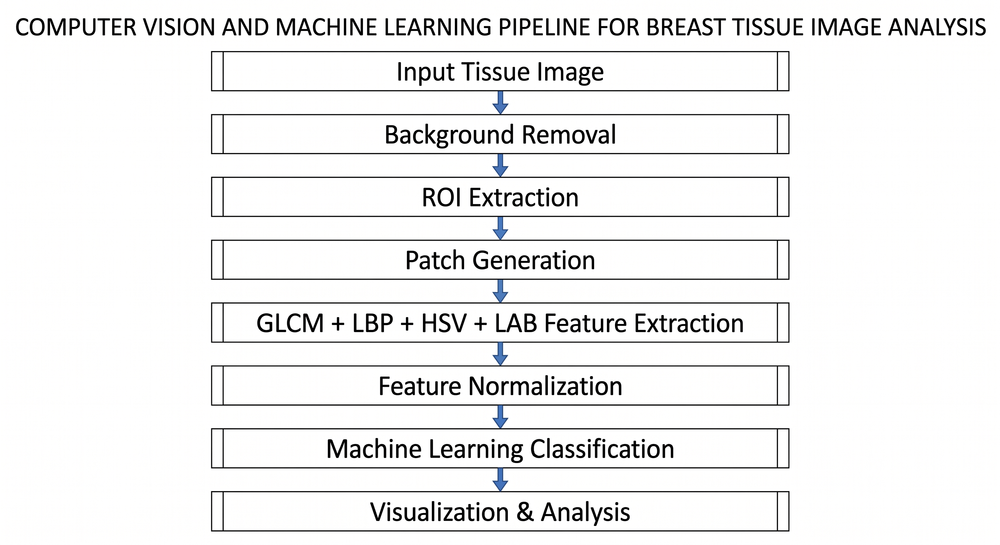

# AI-Based Tissue Image Analysis using Patch-Based Machine Learning

Patch-based Computer Vision framework for breast tissue image analysis using feature engineering and ML classification.

---

## Overview

This project presents a research-oriented Computer Vision framework for analyzing gross breast tissue images using patch-based feature engineering and machine learning classification.

The methodology focuses on extracting meaningful texture, color, and structural information from tissue samples using:
- GLCM texture analysis
- Local Binary Patterns (LBP)
- HSV/LAB color-space analysis
- Patch-based feature engineering
- Machine Learning classification

---
## Workflow

---
## Key Features

- Patch-based tissue analysis
- GLCM texture extraction
- LBP feature extraction
- HSV/LAB feature analysis
- ROI-based preprocessing
- ML classification pipeline
- Feature importance analysis

---

## Repository Structure

- `project_overview.md` → Project summary
- `Methodology — Initial Segmentation...` → Initial failed segmentation-based approach
- `Methodology — Final Patch-Based...` → Final patch-based methodology
- `results.md` → Experimental results and analysis

---

## Results

The project demonstrated promising classification performance with strong sensitivity toward cancer tissue detection using handcrafted feature engineering approaches.

See:
- `results.md`

---

## Research Status

This project is currently under patent preparation.

To protect intellectual property, the following are intentionally withheld:
- complete source code
- full datasets
- trained model weights
- proprietary implementation details

This repository is intended as a research showcase demonstrating:
- methodology
- workflow architecture
- feature engineering techniques
- experimental findings
- visualization outputs

rather than serving as a complete implementation release.
