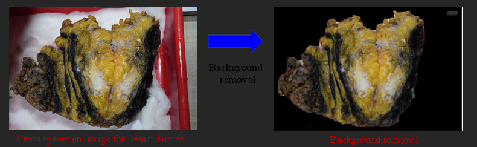
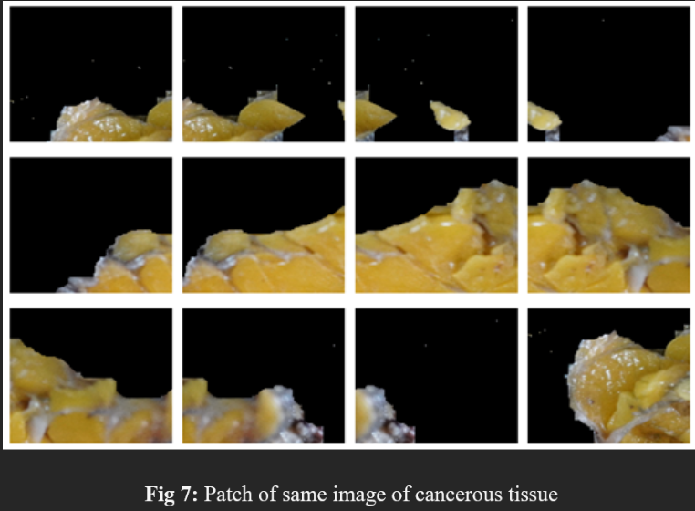
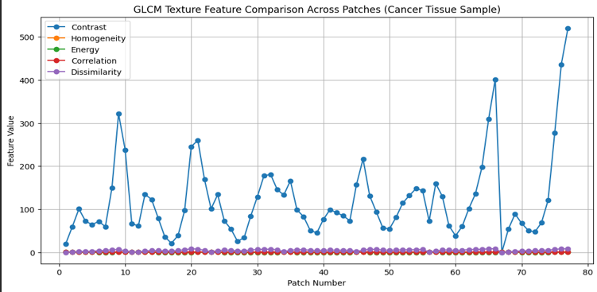
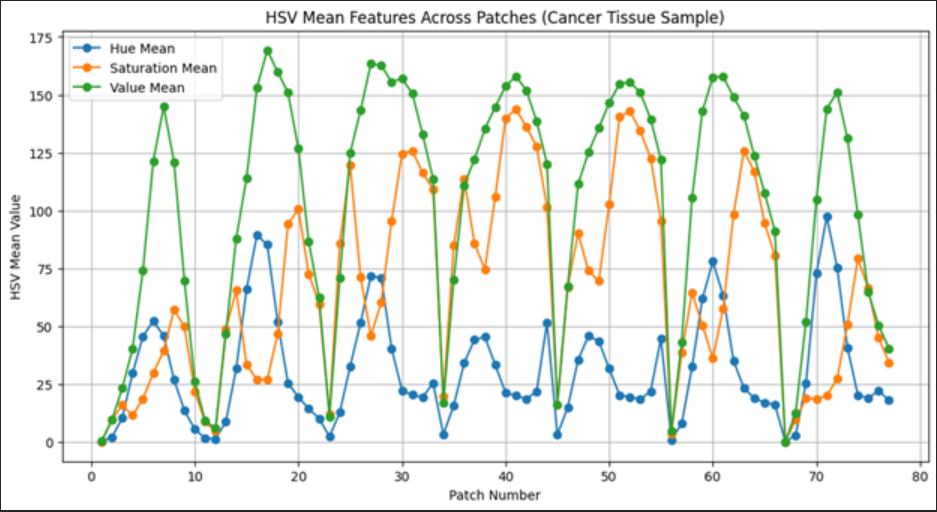
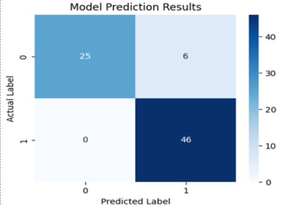
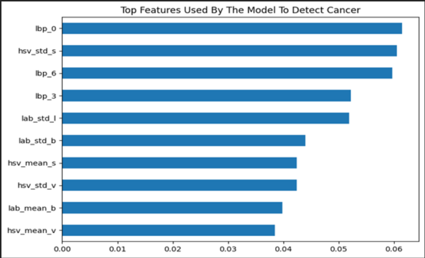

# Results

## 1. Background Removal Results

GrabCut segmentation successfully isolated the tissue specimen from surrounding background artifacts.

The preprocessing pipeline improved feature consistency by ensuring analysis was restricted to biologically relevant tissue regions.

---

## 2. Patch Extraction Results

The framework generated overlapping tissue patches to improve local feature capture and reduce boundary information loss.

Approximately 77 overlapping patches were extracted per image.

---

## 3. Texture Feature Analysis

GLCM-based texture analysis captured variations in tissue heterogeneity.

Cancerous tissue patches generally showed:
- higher contrast
- increased dissimilarity
- stronger texture irregularity

---

## 4. HSV Feature Analysis

HSV-based analysis revealed localized color variations within tissue structures.

These variations contributed significantly toward distinguishing abnormal tissue patterns.

---

## 5. Machine Learning Classification Performance

The extracted feature vectors were normalized and used for supervised classification of tissue samples.

### Confusion Matrix Summary
- True Positives: 46
- True Negatives: 25
- False Positives: 6
- False Negatives: 0

The absence of false negatives indicates strong sensitivity toward cancer tissue detection within the evaluated dataset.

---

## 6. Feature Importance Analysis

Feature importance evaluation indicated that the model relied heavily on:
- Local Binary Pattern (LBP) features
- HSV statistical features
- LAB brightness distributions
- GLCM texture descriptors

---

## 7. Intellectual Property Notice

This project is currently under patent preparation.

To protect intellectual property and ongoing research work, the following are intentionally not publicly released:
- complete source code
- full datasets
- trained model weights
- proprietary preprocessing parameters
- implementation-specific optimization techniques

This repository is intended as a research showcase highlighting:
- methodology
- workflow architecture
- feature engineering techniques
- experimental findings
- visualization outputs

rather than serving as a complete implementation release.
